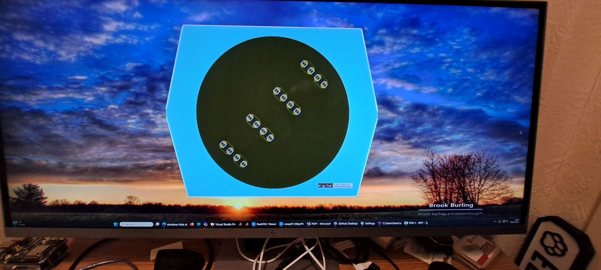

# PDP1-DPY
A Type 30 display for the PiDP1 project  
This app is an optional update for the PiDP1 to create a Type 30 display. 
To start, clone this repo to a convenient location on your Windows or Raspian machine. 
The repo contains a build system for both Linux and Windows (Visual Studio .. not VSCode). 
Both apps are cut down builds from Simh. 
The special feature is the the app can be run on a remote machine. It will connect to a PiDP1 instance as follows. 
On the PiDP1 machine, start the PiDP1 app in 'apps' mode (see the instruction manual for this). 
You will then need to close the P7 Sim window. 
# Windows:
 Under windows, run the pdp1_dpy solution from visual studio. 
The solution file is in the ./Visual Studio Projects directory. 
The app requires SDL3. This is included in the windows build directory.
The app window is 2014x1069 so you need a sizeable display on the windows machine. 
My machine is 5120x2160 with a scale of 150%. 
# Raspbian:
You may build and run the app either on the PiDP1 machine or another Pi on the same network. 
However, here is the tricky bit. The SDL3 development files and libraries are only available for Raspbian Trixie. 
try: sudo apt install libsdl3-dev 
If you can install SDL3 either as above or by other means see: https://chastitywhiterose.com/2025/08/19/installing-sdl3-on-debian-linux/ 
Then in the PDP1-DPY directory, type: ./make.sh 
I have trimmed the dependancies as much as possible but you may find that there are missing libraries. Install and try again. 
# All:
The in the BIN directory, type ./pdp1 and the app should start. 
This version of the app is by default setup for a 1920x1080 display. 
I suggest that you start the PiDP1 and load a tape first as above. 
At the simh prompt, type 'set dpy ena' and then 'att dpy "name of your PiDP1 machine"' and the display should start. 
You may be askimg yourselves, why use SDL3. This library supports transparency so that the DPY display appears as a hexagonal window....  

 
 
# Windows installer
I have now included a Windows installation file in https://github.com/Isysxp/PDP1-DPY/tree/main/DPY_Setup/Release 
Open the .msi file and watch were windows puts the installed files. In this directory, run PDP1.exe. 
# Added functions for all OSs
This app also provides the following options via the simh prompt: 
sim> set dpy scale=(1 or 2) ... 1 is for a large display (at least 2880 x 1800), 2 for a smaller one. Set this BEFORE typeing set dpy ena. 
sim> set psize=(1 or 2 or 3 or 4) ... this changes the pixel size in the display. 
You can change this parameter while the display is running to find the best setting for you. 
 
Ian Schofield Feb 2026.

